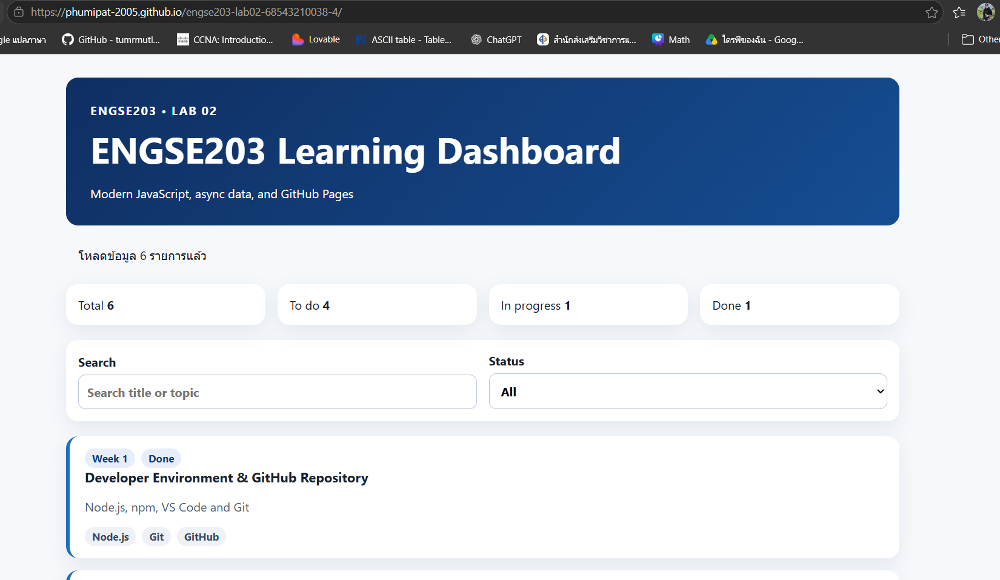
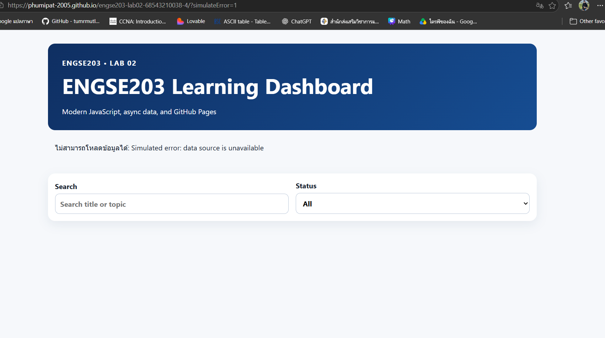

# ENGSE203 LAB 02 — Modern JavaScript, Modules & Async Data

## ผู้จัดทำ

- ชื่อ-นามสกุล: นายภูมิพัฒน์ วงศ์ดาว
- รหัสนักศึกษา: 68543210038-4
- ระบบปฏิบัติการที่ใช้: macOS / Windows

## คำอธิบายโครงงาน

- LAB 02 ไม่ได้มุ่งเพียงให้หน้า Dashboard แสดงผลได้ แต่ให้ผู้เรียนฝึกเขียนโค้ดที่ อ่านง่าย แยกหน้าที่ชัดเจน แก้ไขได้ และรับมือกับข้อมูลจริงได้ เอกสารในโฟลเดอร์ docs/ ทั้ง 4 เรื่องจึงเป็นพื้นฐานที่ต้องเชื่อมไปใช้กับโค้ดใน src/ โดยตรง

## เครื่องมือที่ใช้

- Visual Studio Code , WSL Ubuntu24.04

## วิธีติดตั้งและรัน

```bash
npm install
npm run dev
npm run check
npm run build
```

## ภาพหน้าจอ normal state


## ภาพหน้าจอ error state


## GitHub Pages URL
https://phumipat-2005.github.io/engse203-lab02-68543210038-4

## ปัญหาที่พบและวิธีแก้ไข

- ปัญหา:
- วิธีแก้:

## References & AI Assistance

- Source / Documentation: engse203-lab/labs
/week-02-modern-javascript
- AI tool used:
- Used for: engse203-lab02 — Modern JavaScript, Modules & Async Data
- My adaptation: